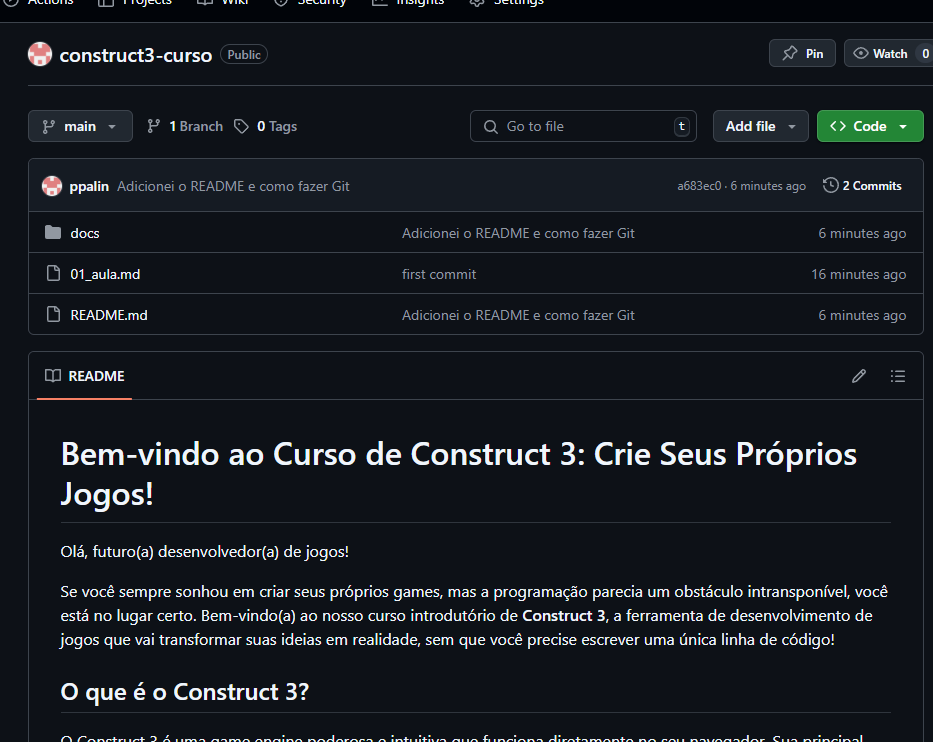

# Criando um Sprite no Construct 3

## O que é um Sprite?

Um **Sprite** é um objeto gráfico que representa personagens, itens ou qualquer elemento visual no seu jogo. No Construct 3, os Sprites são fundamentais para dar vida ao seu projeto, permitindo que você crie animações e interações de forma intuitiva.
## Como criar um Sprite
Para criar um Sprite no Construct 3, siga estes passos simples:
1. **Abra o Construct 3**: Acesse a plataforma através do seu navegador.
2. **Crie um novo projeto**: Clique em "Novo Projeto" e escolha um nome para o seu jogo.
3. **Adicione um Sprite**: No painel esquerdo, clique com o botão direito na área de layout e selecione "Inserir Novo Objeto". Escolha "Sprite" na lista de objetos disponíveis.
4. **Desenhe ou importe sua imagem**: Você pode desenhar diretamente no editor de imagens do Construct 3 ou importar uma imagem existente do seu computador.
5. **Ajuste as propriedades do Sprite**: No painel de propriedades, você pode definir o nome do Sprite, sua posição inicial e outras características.
6. **Salve seu projeto**: Não esqueça de salvar frequentemente para evitar perder seu progresso.

## Dicas para trabalhar com Sprites
- **Organização**: Mantenha seus Sprites organizados nomeando-os de forma clara, como `jogador`, `inimigo`, `plataforma`.
- **Animações**: Utilize o editor de animações do Construct 3 para criar movimentos fluidos e interessantes para seus Sprites.
- **Comportamentos**: Adicione comportamentos aos seus Sprites, como gravidade ou movimento, para facilitar a interação no jogo.

